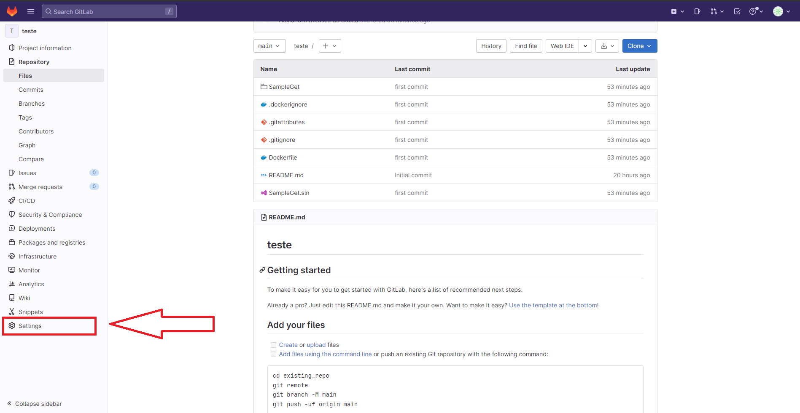
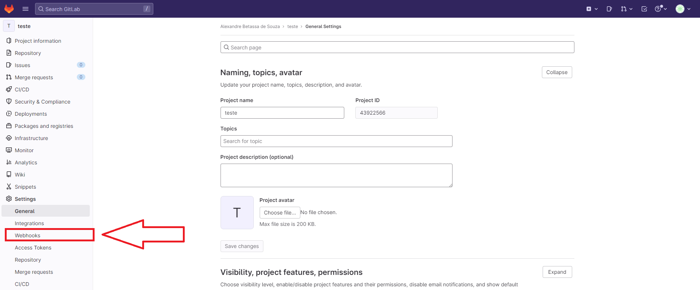
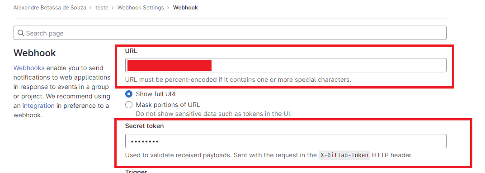
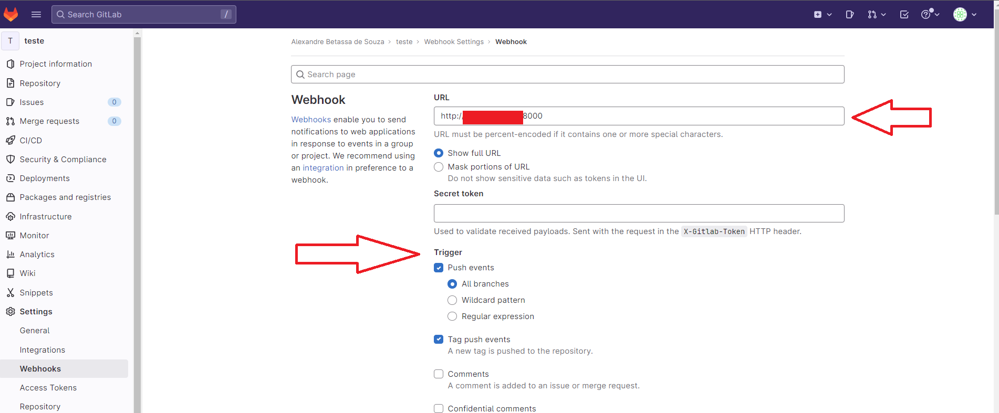
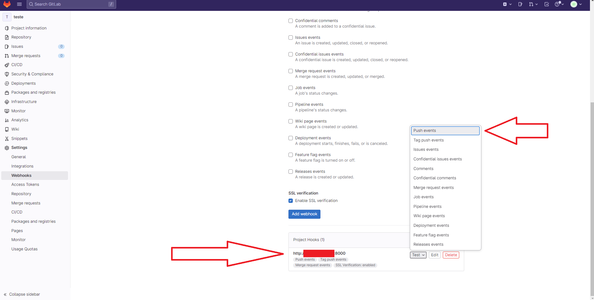

# Tekton-pipeline
## Objetivo
Este projeto tem como objetivo a criação de um projeto simples para implementação de uma pipeline com Tekton-pipelines. Ela possui as tarefas de clonar o código fonte do repositório, fazer o build da imagem e efetuar um push para um repositório no DockerHub.

## Requisitos

    - Cluster de Kubernetes;
    - Noções de programação;
    - Ferramenta kubectl;
___    
## Execução
### Instale o tekton-pipelines

    kubectl apply --filename https://storage.googleapis.com/tekton-releases/pipeline/latest/release.yaml

### Instale tekton-dashboard

    kubectl apply --filename https://storage.googleapis.com/tekton-releases/dashboard/latest/release.yaml

Faça o port-forward do dashboard tekton:

    kubectl port-forward svc/tekton-dashboard 9097 -n tekton-pipelines

___
### Instale tekton-triggers

    kubectl apply --filename https://storage.googleapis.com/tekton-releases/triggers/latest/release.yaml

### Instale os Interceptors

    kubectl apply --filename https://storage.googleapis.com/tekton-releases/triggers/latest/interceptors.yaml

___
### Instale as Tasks
#### Git-Clone

    kubectl apply -f https://raw.githubusercontent.com/tektoncd/catalog/main/task/git-clone/0.6/git-clone.yaml

#### Kaniko

    kubectl apply -f https://raw.githubusercontent.com/tektoncd/catalog/main/task/kaniko/0.6/kaniko.yaml
___
### Credenciais
#### - Docker
Para que o processo ocorra de maneira segura e você possa acessar os repositórios, é necessário criar algumas secrets no kubernetes.
Para isso navegue até a pasta credentials:

    cd ./credentials

Abra arquivo "docker-credentials.yml" com o editor de textos de sua preferência e onde esta o valor "config.json:" coloque o valor das suas credenciais docker codificado em base64. Caso não saiba execute no terminal:

    cat ~/.docker/config.json | base64 -w 0

Caso não possua essas credenciais, consulte documentação [Docker](https://docs.docker.com/engine/reference/commandline/login/).
#### - Git
Abra arquivo "git-credentials.yml" com o editor de textos de sua preferência e onde esta o parâmetro "id_rsa:" coloque o valor da sua chave .ssh codificado em base64. Caso não saiba execute no terminal:

    cat ~/.ssh/id_rsa | base64 -w 0

No parâmetro "token", insira um código que funcionará como uma senha para autenticar o webhook do repositório com a sua pipeline. Esse valor você pode criá-lo, mas lembre-se que precisará dele para configurar o webhook no repositório.
Caso não tenha uma chave ssh consulte documentação [GitLab](https://docs.gitlab.com/ee/user/ssh.html)
Execute:

    kubectl apply -f .
___
### Pipeline
Após criar as credenciais, se você estiver na pasta credentials, execute o comando:

    cd ../pipeline && kubectl apply -f .

Isso criará configurará a pipeline.
___
### Triggers
Após criar a pipeline, se você estiver na pasta pipeline, execute o comando:

    cd ../triggers && kubectl apply -f .
___
### Configurar GitLab
No repositório em que deseja configurar o webhook, acesse "Settings":

"Webhook": 

Abrirá a tela de configuração do webhook. Para configurá-lo, será necessário o endereço do seu eventlistener, volte ao terminal e execute:

    kubectl get svc el-trigger-ref-eventlistener

Ele retornará os serviços disponiveis, nesse caso criamos um "eventlistener" com serviço de "LoadBalancer". Copie o valor do campo "EXTERNAL-IP" e o valor do compo "PORT(s)". Esses valores são referentes ao host e a porta do qual seu serviço está sendo executado e receberá os webhooks.
No campo URL coloque o endereço e a porta. Ex: "http://<host>:<port>" e no campo token insirá o mesmo valor do parametro "token" de git-credentials.

Configure os eventos em que os webhooks serão disparados.

Clique em Add Webhook. Ele aparecerá abaixo criada e com algumas opções, uma delas é "test". Clique e selecione a opção compativel com um evento que você configurou.

Se tudo estiver certo, sua pipeline irá executar.

## REFERÊNCIA
    
[TEKTON PIPELINES](https://tekton.dev/docs/)

[WEBHOOKS GITLAB](https://docs.gitlab.com/ee/user/project/integrations/webhooks.html)

[DOCKER LOGIN](https://docs.docker.com/engine/reference/commandline/login/)

[GITLAB SSH](https://docs.gitlab.com/ee/user/ssh.html)

 ## PARA SUGESTÕES DEIXE COMENTÁRIOS NO ISSUES.